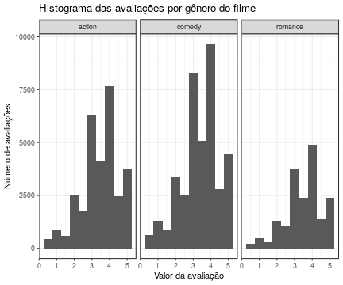
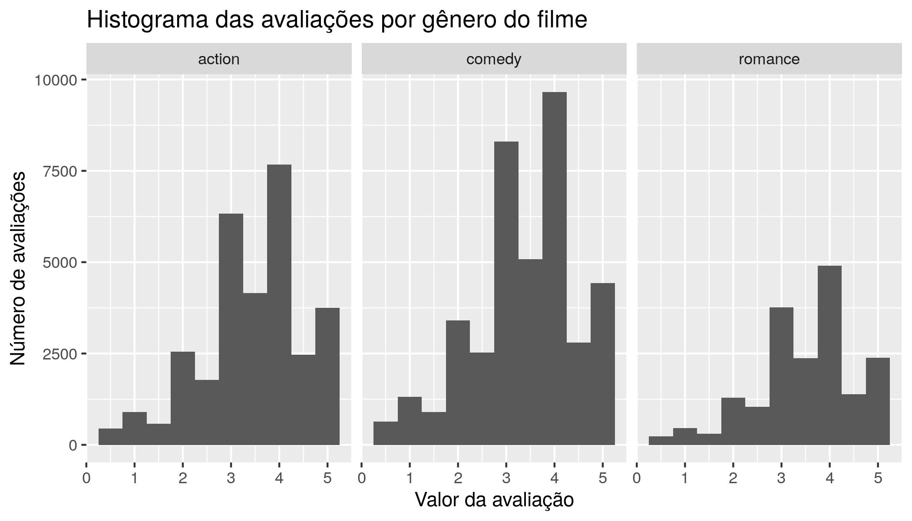
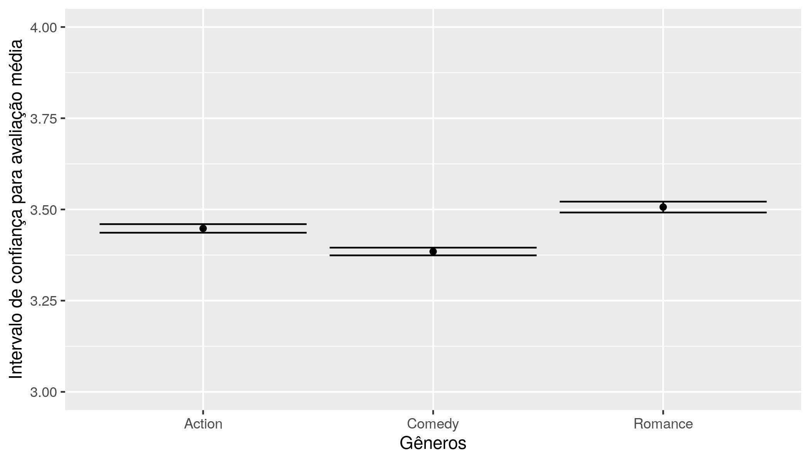
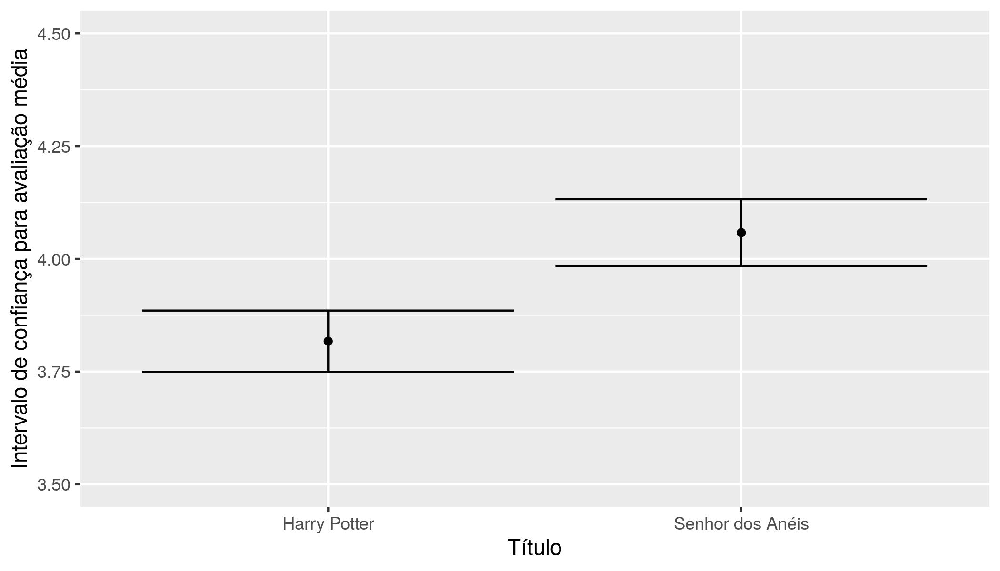

### Universidade Federal de Campina Grande | UFCG 
### Ciência da Computação 
### Ciência de Dados Descritiva 
### **Professor**: Nazareno Andrade 
### **Aluno(a)**: Fabiana Alves Gomes

<center style="margin:1rem">

</center>

\newpage

## Introdução 

Este relatório se propõe a fazer inferências estátisticas dentro de um intervalo de confiança para um conjunto de dados sobre avaliações de usuários a filmes que já assistiram. 

Os dados são fornecidos pelo ***[GroupLens](https://grouplens.org/about/what-is-grouplens/)***, 
que é um laboratório de pesquisa no **Departamento de Ciência da Computação e Engenharia** na ***[University of Minnesota, Twin Cities](https://twin-cities.umn.edu/)***.

Os dados que utilizaremos foram atualizados pela última vez em **09/2018**, eles pertencem ao **menor dataset** fornecido pelo ***GroupLens*** e são compostos de *100.000 avaliações* e *3.600 tags* aplicadas a *9.000 filmes* por *600 usuários.*
Os dados fornecidos[¹](https://grouplens.org/datasets/movielens/), podem ser atualizados sem aviso prévio. Portanto, os dados utilizados para a elaboração deste relatório ficarão disponíveis em um endereço específico[²](#data), junto aos artefatos necessários para criação desse relatório.


### Referências: 
  - ¹ - https://grouplens.org/datasets/movielens/ 
  - ² - https://github.com/fabianaag/cdd


\newpage

## Desenvolvimento


```r
  movies = read.csv('./dados/movies.csv')
  ratings = read.csv('./dados/ratings.csv')
```

Como os dados que temos em mãos, iremos orientar essa análise por duas perguntas. 

  1. **Dentre os gêneros de *Ação*, *Romance* e *Comédia*; Algum deles recebe avaliação mais alta?**
  2. ***Senhor dos Anéis* vs *Harry Potter*, algum dos dois é melhor avaliado?** 

--- 

Para responder as perguntas precisamos manipular os dados. 
Ou seja, precisamos encontrar nos dados os filmes que se encaixam nas restrições das perguntas que queremos responder, filtrando pelos gêneros e titulos específicos da franquia ***Senhor dos Anéis*** E ***Harry Potter***.

---

```r
  action_movies = movies %>% filter(grepl('Action', genres)) 
  romance_movies = movies %>% filter(grepl('Romance', genres))
  comedy_movies = movies %>% filter(grepl('Comedy', genres))
  
  harry_movies = movies %>% filter(grepl('Harry Potter', title))
  lotr_movies = movies %>% filter(grepl('Lord of the Rings', title))
  
  # Para conferir os filmes encontrados
  kable(bind_rows(lotr_movies, harry_movies)['title'])
```


|title                                                                                          |
|:----------------------------------------------------------------------------------------------|
|Lord of the Rings, The (1978)                                                                  |
|Lord of the Rings: The Fellowship of the Ring, The (2001)                                      |
|Lord of the Rings: The Two Towers, The (2002)                                                  |
|Lord of the Rings: The Return of the King, The (2003)                                          |
|Harry Potter and the Sorcerer's Stone (a.k.a. Harry Potter and the Philosopher's Stone) (2001) |
|Harry Potter and the Chamber of Secrets (2002)                                                 |
|Harry Potter and the Prisoner of Azkaban (2004)                                                |
|Harry Potter and the Goblet of Fire (2005)                                                     |
|Harry Potter and the Order of the Phoenix (2007)                                               |
|Harry Potter and the Half-Blood Prince (2009)                                                  |
|Harry Potter and the Deathly Hallows: Part 1 (2010)                                            |
|Harry Potter and the Deathly Hallows: Part 2 (2011)                                            |
---

Agora que filtramos os tipos de filmes que temos interesse, devemos filtrar as avaliações relacionadas a esses filmes. 


```r
  ratings_action =  ratings %>% 
                    inner_join(action_movies, by="movieId") %>% 
                    mutate(genre='action') %>% 
                    select(rating, genre)
  ratings_comedy =  ratings %>% 
                    inner_join(comedy_movies, by="movieId") %>% 
                    mutate(genre='comedy') %>% 
                    select(rating, genre)
  ratings_romance = ratings %>% 
                    inner_join(romance_movies, by="movieId") %>% 
                    mutate(genre='romance') %>% 
                    select(rating, genre)
  
  # Essa transformação fará com que todos os filmes da franquia, fiquem com o mesmo título.
  ratings_lotr =    ratings %>% 
                    inner_join(lotr_movies, by="movieId") %>% 
                    mutate(title='Lord of the Rings') %>% 
                    select(rating, title)
  ratings_harry =   ratings %>% 
                    inner_join(harry_movies, by="movieId") %>% 
                    mutate(title='Harry Potter') %>% 
                    select(rating, title)
  
  # Unindo 'Genero, Rating' em um dataframe só.
  ratings_unions =  ratings_action %>% 
                    bind_rows(ratings_comedy) %>% 
                    bind_rows(ratings_romance)
```


#### 1. Dentre os gêneros de Ação, Romance e Comédia; Algum deles recebe avaliação mais alta?


```r
  ratings_unions_sum = ratings_unions %>% 
                       group_by(genre) %>% 
                       summarise(mean=mean(rating), median=median(rating))
  kable(ratings_unions_sum)
```


|genre   |     mean| median|
|:-------|--------:|------:|
|action  | 3.447984|    3.5|
|comedy  | 3.384721|    3.5|
|romance | 3.506511|    3.5|


Ao observar esses dados, não é possível ter conclusões rápidas sobre a tendência da avaliação dos espectadores para estes gêneros.

A mediana é 3.5 para todos os filmes, já a média é maior para os gêneros de Romance, Ação e Comédia respectivamente.

Vamos aplicar um intervalo de confiança de 95%, ou seja, espera-se que o intervalo de confiança contenha a média da população 95% do tempo.

```r
  ggplot(ratings_unions, aes(rating)) +
    geom_histogram(binwidth = .5) + 
    facet_grid(. ~ genre) + 
    ggtitle("Histograma das avaliações por gênero do filme") + 
    ylab("Número de avaliações") + 
    xlab("Valor da avaliação")
```



```r
  ggsave('histogram.jpg', height = IMAGE_HEIGHT) 
```

```
## Saving 6 x 4 in image
```




Como podemos observar, os dados se distribuem de maneira normal fazendo com que se tornem bons dados para esse tipo de análise. 

Ao gerar os intervalos de confiança temos: 


```r
  header = c('Romance', 'Action', 'Comedy')
  cis =  data.frame(
            CI(ratings_romance[['rating']], ci=0.95),
            CI(ratings_action[['rating']], ci=0.95), 
            CI(ratings_comedy[['rating']], ci=0.95)
          )  
  
  names(cis) = header
  t_cis = data.frame(t(cis))


  cis_generos = ggplot(t_cis, aes(rownames(t_cis), mean, ymin=lower, ymax=upper)) +
    geom_errorbar(aes(ymin=0, ymax=5)) +
    scale_y_continuous(breaks=c(4,5,6,7,8), limits=c(4,8))+
    geom_point(mapping = aes(rownames(t_cis), y=mean)) +
    xlab("Gêneros") + ylab("Intervalo de confiança para avaliação média")
  ggsave('cis_generos.jpg', height=IMAGE_HEIGHT)
```

```
## Saving 6 x 4 in image
```

```
## Warning: Removed 3 rows containing missing values (geom_errorbar).
```

```
## Warning: Removed 3 rows containing missing values (geom_point).
```



--- 

####  2. ***Senhor dos Anéis* vs *Harry Potter*, algum dos dois é melhor avaliado?** 

Para responder essa pergunta iremos fazer um processo similar ao anterior. 


```r
  d = bind_rows(ratings_lotr, ratings_harry) %>% group_by(title) %>% summarise(mean=mean(rating), median=median(rating))
  kable(d)
```


|title             |     mean| median|
|:-----------------|--------:|------:|
|Harry Potter      | 3.817406|      4|
|Lord of the Rings | 4.058020|      4|

Podemos ver que a mediana e a média seguem comportamento igual a análise anterior, porém a distância das médias é um pouco maior para esse subconjunto dos dados.

Gerando o intervalo de confiança temos:


```r
  ci_lotr = CI(ratings_lotr[['rating']], ci=0.95)
  ci_harry = CI(ratings_harry[['rating']], ci=0.95)
  
  cis = data.frame(ci_lotr, ci_harry)
  names(cis) = c('Senhor dos Anéis', 'Harry Potter')
  
  cis = data.frame(t(cis))
  
  var = ggplot(cis, aes(rownames(cis), mean, ymin=lower, ymax=upper)) +
    geom_errorbar() +
    geom_point(mapping = aes(rownames(cis), y=mean)) +
    xlab("Título") + ylab("Intervalo de confiança para avaliação média")
  ggsave('cis_titulos.jpg', height=IMAGE_HEIGHT)
```

```
## Saving 6 x 4 in image
```



\newpage 

## Conclusão 

Ao analisar os dados de avaliação desses filmes é difícil fazer afirmações apenas com medidas como média ou medianas. Principalmente quando as médias estão muito próximas umas das outras é difícil dizer que a média de um determinado filme é maior que outra. 

Aplicando um intervalo de confiança, com um nível de confiança relativamente alto nesses dados que apresentam uma distribuição normal ficamos um pouco mais confortáveis em fazer afirmações sobre a média de uma amostra da população. 

Se considerarmos que a população real, ou seja as opiniões dos espectadores dos filmes aqui listados, está em concordância com a amostra que analizamos então outras amostras da população real teriam resultados próximos aos encontrados. 

Na nossa análise pode-se dizer que nossas respostas indicam que:

1. **Dentre os gêneros de *Ação*, *Romance* e *Comédia*; Algum deles recebe avaliação mais alta?**
  - Sim, os espectadores deram em média avaliações mais altas para os filmes de Romance, Ação e Comédia respectivamente.
2. ***Senhor dos Anéis* vs *Harry Potter*, algum dos dois é melhor avaliado?** 
  - Sim, para um intervalo de confiança de 95% a avaliação média dos filmes de **O Senhor dos Anéis** (3.98 ~ 4.13), costuma ser mais alta do que a avaliação média de **Harry Potter** (3.75 ~ 3.88)
  
